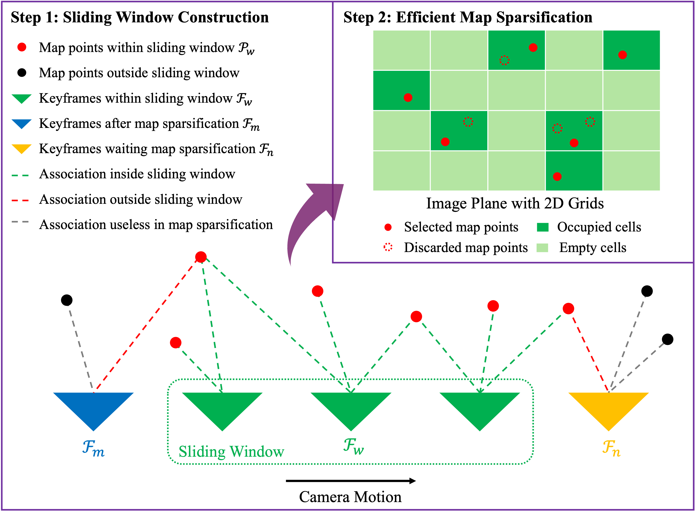








# Welcome!
I am Xiaoyu Zhang (张啸宇), a third year PhD student from The Chinese University of Hong Kong (CUHK), under the supervision of Prof.[Yun-hui Liu](https://www4.mae.cuhk.edu.hk/peoples/liu-yun-hui/). I got my master and bachelor degree from Beihang University (BUAA), advised by Prof.[Wei Wang](http://www.me.buaa.edu.cn/info/1072/1897.htm). I am also fortunate to work with Dr.[Ji Zhao](https://sites.google.com/site/drjizhao/) and Prof.[Shiyu Zhao](https://www.shiyuzhao.net/).

My research interests include computer vision in self-driving, SLAM and robotics.

# 🔥 News
- *2024.08*: &nbsp;🎉🎉 One paper on memory-efficient SLAM is accepted by JFR! 
- *2024.07*: &nbsp;🎉🎉 Two papers on HD map construction are accepted by ECCV 2024! 
- *2023.02*: &nbsp;🎉🎉 One paper on map sparsification is accepted by CVPR 2023!
- *2022.02*: &nbsp;🎉🎉 Two papers are accepted by RA-L and will be presented in ICRA 2022!
  
# 📝 Recent Publications 
For the full lists, please refer to my [Google Scholar](https://scholar.google.com/citations?hl=en&user=GUbdeFsAAAAJ&view_op=list_works&sortby=pubdate) page

*Equal contribution

  

    

 JFR 

  

  

MS-SLAM: Memory‐Efficient Visual SLAM with Sliding Window Map Sparsification
    
**Xiaoyu Zhang**, Jinhu Dong, Yin Zhang, and Yun-hui Liu

Journal of Field Robotics

[code](https://github.com/fishmarch/MS-SLAM)

  

    

ECCV 2024

  

  

Enhancing Vectorized Map Perception with Historical Rasterized Maps
    
**Xiaoyu Zhang\***, Guangwei Liu*, Zihao Liu, Ningyi Xu, Yun-hui Liu, and Ji Zhao

The European Conference on Computer Vision (ECCV) 2024

[[paper]](https://arxiv.org/abs/2409.00620)
[[code]](https://github.com/HXMap/HRMapNet)

  

    

ECCV 2024

  

  

Leveraging Enhanced Queries of Point Sets for Vectorized Map Construction
    
Zihao Liu*, **Xiaoyu Zhang\***, Guangwei Liu*, Ji Zhao, and Ningyi Xu

The European Conference on Computer Vision (ECCV) 2024

[[paper]](https://arxiv.org/abs/2402.17430)
[[code]](https://github.com/HXMap/MapQR)

  

    

CVPR 2023

  

  

Efficient Map Sparsification Based on 2D and 3D Discretized Grids
    
**Xiaoyu Zhang**, and Yun-hui Liu

IEEE/CVF Conference on Computer Vision and Pattern Recognition (CVPR) 2023

[[paper]](https://openaccess.thecvf.com/content/CVPR2023/html/Zhang_Efficient_Map_Sparsification_Based_on_2D_and_3D_Discretized_Grids_CVPR_2023_paper.html)
[[code]](https://github.com/fishmarch/SLAM_Map_Compression)

  

    

RA-L & ICRA 2022

  

  

Robust Localization of Occluded Targets in Aerial Manipulation Via Range-Only Mapping
    
**Xiaoyu Zhang**, Yin Zhang, Peidong Liu, and Shiyu Zhao

IEEE Robotics and Automation Letters (RA-L), presented in ICRA 2022

[[paper]](https://ieeexplore.ieee.org/document/9691791)

# 📖 Educations
- *2021 - present*, Ph.D. in Mechanical and Automation Engineering, **The Chinese University of Hong Kong**
  - T-Stone Robotics Institue, advised by Prof.[Yun-hui Liu](https://www4.mae.cuhk.edu.hk/peoples/liu-yun-hui/)
  - Fields: 3D computer vision, self-driving  
- *2017 - 2020*, M.Phil. in Mechanical Engineering, **Beihang University**
  - Robotics Institute, advised by Prof.[Wei Wang](http://www.me.buaa.edu.cn/info/1072/1897.htm)
  - Fields: SLAM, mobile robotics
- *2013 - 2017*, B.S. in Mechanical Engineering, **Beihang University**

# 💻 Work Experience
- *2020 - 2021*, Westlake University
  - Research assistant, advised by Prof. [Shiyu Zhao](https://www.shiyuzhao.net/)
  - Fields: computer vision for UAV
- *2019*, DiDi Chuxing
  - Intern in SLAM, The Group of Visual Computing.
  
# 🎖 Honors and Awards
- *2021-2025*, CUHK Vice-Chancellor's PhD Scholarship
- *2021-2025*, CUHK Postgraduate Scholarship
- *2017*, First Prize in ``Challenge Cup" Capital College Student Curricular Academic Science and Technology Works Competition
- *2017*, Beijing Outstanding Graduate
- *2015*, National Scholarship
- *2014*, National Scholarship

